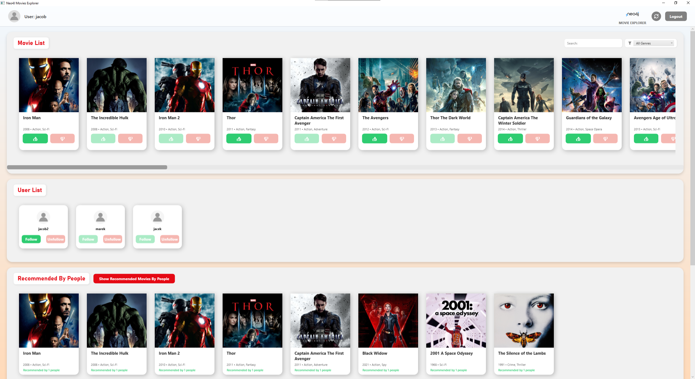

<div align="justify">

# Movie Explorer (**Neo4J** **WPF** App)

Aplikacja desktopowa napisana w **WPF** (**.NET**), służąca do przeglądania bazy filmów, wyszukiwania, filtrowania oraz otrzymywania inteligentnych rekomendacji filmowych w oparciu o grafową bazę danych **Neo4J**.

## Wygląd aplikacji


---

## Architektura i Koncepcja
Aplikacja została zbudowana na architekturze klient-serwer. Klient (**WPF**) łączy się zdalnie z silnikiem grafowej bazy danych **Neo4j** za pomocą oficjalnego sterownika. 

Najważniejsze cechy:
* Bezpieczeństwo: Hasła użytkowników są rygorystycznie hashowane algorytmem **BCrypt** przed zapisaniem do bazy danych.
* Rozproszony dostęp: Architektura oparta na bazie sieciowej pozwala użytkownikowi zalogować się na to samo konto z wielu instancji aplikacji (na różnych komputerach) i zawsze mieć dostęp do swoich aktualnych polubień.
* Rekomendacje: Silnik bazy grafowej służy do skomplikowanych zapytań agregujących polubione gatunki lub śledzonych użytkowników, generując personalizowane rekomendacje.

---

## Spis technologii
Projekt został napisany w oparciu o następujące technologie i wersje:
- **.NET** 10.0 (net10.0-windows10.0.17763.0)
- **WPF** (**Windows Presentation Foundation**, **C#** + **XAML**)
- **Neo4j.Driver** (wersja 6.0.0)
- **BCrypt.Net-Next** (wersja 4.1.0) oraz **BCrypt** (wersja 1.0.0)

---

## Sposób uruchomienia

1. Uruchom swoją instancję bazy danych **Neo4J** (**Neo4j Desktop**, **Aura** lub kontener **Docker**).
2. Sklonuj repozytorium na swój dysk.
3. Otwórz terminal w głównym folderze projektu.
4. Uruchom komendę:
   ```bash
   dotnet build
   dotnet run
   ```
5. Alternatywnie (w przypadku **Visual Studio**): Otwórz plik solucji (.sln) lub projekt (.csproj) w IDE **Visual Studio** 2022+ i kliknij zielony przycisk "Start" (lub wciśnij F5), aby skompilować i uruchomić projekt.
6. Po uruchomieniu aplikacji ukaże się okno autoryzacji - wpisz URI swojej bazy, login i hasło, po czym zaloguj się lub zarejestruj konto.

---

## Dodawanie przykładowych danych (Payload)
Aby aplikacja miała co wyświetlać, możesz zasilić bazę **Neo4J** przykładowymi danymi filmów, używając gotowego skryptu z repozytorium.

1. Przejdź do folderu `Data` w repozytorium.
2. Otwórz plik `MovieImportQuery.txt`.
3. Zaloguj się do interfejsu przeglądarkowego swojej bazy **Neo4J** (np. http://localhost:7474).
4. Skopiuj całą zawartość pliku `MovieImportQuery.txt` do pola zapytania (**Query**) i uruchom.

do pobierania plików graficznych na podstawie linków zawartych w bazie dostępny jest dedykowane narzędzie do pobierania plakatów, dzięki któremu w szybki sposób zgrasz wszystkie okładki bezpośrednio do folderu `Posters`.

---

## Znane ograniczenia i braki aplikacji
Obecnie projekt posiada następujące ograniczenia:
1. Pamięć sesji: Aplikacja nie zapamiętuje ustawień połączenia. Przy każdym uruchomieniu programu konieczne jest ponowne wpisanie URI oraz danych dostępowych.
2. Walidacja: Mechanizm rejestracji nie weryfikuje rygorystycznie wszystkich pól danych (np. formatu email).
3. Plakaty: System obrazków opiera się na plikach fizycznie obecnych w folderze `Posters`. Nie pobierają się one same na żywo podczas używania aplikacji.
4. Wydajność początkowa: Pobieranie całej bazy na start do RAM-u umożliwia szybkie działanie potem, ale może wydłużyć czas ładowania aplikacji przy bardzo dużych zbiorach danych.

</div>